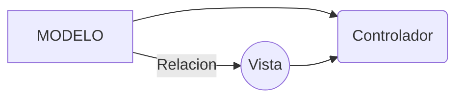

# Proyecto FedeSoft

Este repositorio tiene los siguientes elementos:
* Estilos
* Vista Principal
* Vistas Secundarias
* JavaScript relacionado

Creado Por Francisco Javier González (fjgonzo@gmail.com)

Se utiliza el Modelo-Vista-Controlador (MVC):

