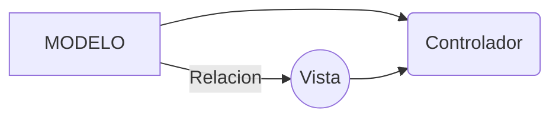

# Proyecto FedeSoft

##### DESCRIPCIÓN: DESARROLLO FULL STACK Y TECNOLOGÍAS HÍBRIDAS

```
A lo largo de este programa vas a adquirir los conocimientos necesarios para un trabajo en Desarrollo Web Full Stack como iniciante; adicional a ello, vas a poder desarrollar aplicaciones y sitios web complejos, creando y configurando aquellas operaciones que ocurren en un servidor con bases de datos (el Back-end), al igual que la experiencia que ven y ocurre del lado de sus usuarios (el Front-end).

Los conocimientos se adquieren a través de la realización de los cursos conceptuales y talleres prácticos que los acompañan, para obtener las habilidades necesarias para realizarlos.

Este proyecto representa un apoyo concreto de parte del gobierno para asegurarte que tus conocimientos van en línea con el desarrollo y tecnologías más demandadas. Las tecnologías utilizadas en este programa son: HTML5, CSS3, JavaScript, Git, Protocolo HTTP, APIs REST, Ruby, Ruby on Rails, PostgreSQL, Ionic 3, Angular 5
```


Este repositorio tiene los siguientes elementos:
* Estilos
* Vista Principal
* Vistas Secundarias
* JavaScript relacionado

Creado Por Francisco Javier González (fjgonzo@gmail.com)

Se utiliza el Modelo-Vista-Controlador (MVC):


